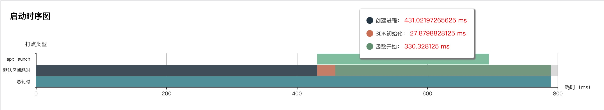

# 婚芭莎App的APM性能监控实践
- [婚芭莎App的APM性能监控实践](#婚芭莎app的apm性能监控实践)
  - [需求场景](#需求场景)
  - [调研](#调研)
  - [目标](#目标)
  - [主要功能](#主要功能)
    - [启动耗时](#启动耗时)
      - [启动耗时过程统计](#启动耗时过程统计)
      - [启动类型](#启动类型)
      - [指标](#指标)
    - [网络监控](#网络监控)
      - [网络错误](#网络错误)
      - [慢请求](#慢请求)
      - [指标](#指标-1)
    - [崩溃](#崩溃)
    - [内存监控](#内存监控)
    - [卡慢监控](#卡慢监控)
      - [卡顿监控](#卡顿监控)
      - [方法聚类](#方法聚类)
      - [指标](#指标-2)
    - [资源监控](#资源监控)
    - [WebView和JS](#webview和js)
    - [告警](#告警)
  - [使用](#使用)
    - [开启对应功能](#开启对应功能)
    - [采样率](#采样率)
  - [SDK评测](#sdk评测)
  - [问题](#问题)
  - [总结](#总结)


## 需求场景

现在App的开发技术栈相对成熟，而提升App的用户体验，就成了个App和竞品之间的一个竞争点。<br>

之前我们的App在性能方面基本只有Crash（崩溃）相关的统计，在其他性能方面并没有很好的监控工具和指标数据，对于App的卡慢、接口异常、慢请求、内存泄漏等性能问题线上环境并没有很好的监控措施。<p>

即使我们的每个功能改动都会经过QA团队的测试，但在QA测试环节可能更关注是业务功能完整，还是很难发现App存在的隐形性能问题。<p>

为了支持我们以后更大的用户量和App的稳定性，所以必须对App的性能和稳定性进行监控，主动发现性能问题，而不是等运营或产品反馈过来，就会很被动了。所以我们考虑介入APM系统，进行性能监控，从技术层面主动发现问题，来对应用的性能进行线上的监控和预警。<p>

## 调研
我们调研的APM平台
| 产品 | 厂商 |
| :---- | :---- |
| QAPM      | 腾讯 |
| 听云App    | 听云 |
| 阿里云EMAS | 阿里云 |
| mPaaS     | 蚂蚁金服 |
| U-APM     | 友盟 |
| 火山引擎    | 字节 |
| Firebase | Google |
| ... | ...|

目前市场上移动端APM监控平台还是比较多，可能选择适合自己的尤为重要。<br>
因为我们在除了基本的Crash、网络性能、WebView性能基本的性能统计外，希望全面监控App的内存、电量、滑动卡帧、这几项有较高的优化期望，QAPM监控功能覆盖这几部分功能。<br>
经过我们内部调研评审，最终考虑使用QAPM。<p>

QAPM目前还未正式商业化，目前处于免费使用阶段，使用的话需要从[官网](https://cloud.tencent.com/product/qapm)申请资格。<p>
且有 QQ系列多个App产品也在使用此套APM系统，有较大的线上使用案例和技术支持团队，且使用的话会创建专项的微信技术支持群，感觉技术支持还是非常好的。


## 目标
1. 将App性能数据，以科学的量化指标展现出来。
2. 主动发现性能问题，实时预警通达，将问题发现时机前置。
3. App稳定性提升，用户体验改善优化。<p>


## 主要功能
### 启动耗时
启动耗时是一个性能上重要的指标，QAPM对于启动统计氛围三个阶段：<br>
#### 启动耗时过程统计
1. 创建进程阶段，也就是main函数之前的时间。
2. QAPM初始化的时间
3. main函数之后，到首个启动页面的时间。



#### 启动类型
自动类型统计主要分为三种：
1. 冷启动
2. 热启动
3. 首次启动

#### 指标
启动维度可以通过 版本、系统、设备、地区、运营商等分别查看指标数据。

### 网络监控
通过吞吐量、请求次数、网络响应时间、慢请求占比、HTTP错误率、网络错误率等指标进行网络问题分析。错误列表去要区分为网络问题和慢请求。
#### 网络错误
网路错误主要为HTTP协议异常请求或DNS解析等问题，实时监控线上接口的报错情况。<br>
#### 慢请求
慢请求主要统计网络请求过程超过设置慢请求的阈值，即统计为慢请求，主要用于接口性能优化。
#### 指标
可以通过 版本、网路类型、地域、运营商、主机IP、域名、URL等维度进行筛选查看不同维度的指标。<p>

### 崩溃
崩溃统计QAPM区分为两种类型：普通崩溃和Sigkill崩溃。<p>
### 内存监控
可分析得出的内存泄漏对象的调用堆栈内存问题，内存问题主要分为三类查看
1. 内存泄漏
2. VC泄漏，如iOS平台的[MLeaksFinder](https://github.com/Tencent/MLeaksFinder)基本类似
3. 大块内存分配
<p>


### 卡慢监控

#### 卡顿监控
关于卡慢监控，QAPM相对来说可能更全面一点；目前大多数对于卡顿的检测为主线程堵塞时间超过阈值时间多少秒为卡顿事件，QAPM这里支持列表或ScrollView的滑动卡桢监控。
1. 卡顿监控
   除滑动外其它场景卡断监控，如iOS平台以CADisplayLink的刷新间隔（16.6ms）不断抓取主线程堆栈。
2. 滑动卡帧监控
   监控列表滑动时候的卡帧情况；非全局监控设置，需要在监控的列表开始滑动和滑动结束时分别埋点，可以自定义别名命名滑动场景。

#### 方法聚类
方法聚类统计所有方法包括子方法的调用耗时，在后台展示调用耗时较高的方法调用，工程师直接参考耗时代码的定位。

#### 指标
卡顿后台可以通过 应用版本、系统版本、场景（用户定义）、设备等维度查看卡慢数据。也可以看到个时间段App的掉帧率所占百分比，同时可以将此百分比定义为App流畅性的优化指标。<p>


### 资源监控
资源使用情况监控将每一秒采集CPU、内存、IO、网络等数据，每一分钟上报一下数据。<p>

### WebView和JS
通过H5页面加载耗时、慢加载占比以及JS错误率等进行WebView指标分析。<p>


### 告警
支持选择对应的性能功能发用预警报告。<p>
报告方式为两种：
1. 邮箱
2. 企业微信

当然关于通知方面，如果之后可以支持webhook可能就更完美了，可以自定义自己的通知方式！<p>

## 使用
### 开启对应功能

QAPM默认开启所有性能数据收集，也可以根据实际需求场景自定义开关项。<br>
拿iOS举例，通过`[QAPMConfig getInstance].enableMonitorTypeOptions`设置指定功能，功能列表如下列枚举：
```objc
/**
 开启功能类型
 */
typedef NS_OPTIONS(NSUInteger, QAPMMonitorType) {
    
    QAPMMonitorTypeNone                     = 1 << 0,

    /// Blue(检测卡顿功能)
    QAPMMonitorTypeBlue                     = 1 << 3,
    
    /// 大块内存分配监控功能
    QAPMMonitorTypeBigChunkMemoryMonitor    = 1 << 4,

    /**
     QQLeak(检测内存对象泄露功能)
     开启后，会记录对象分配的堆栈，不支持模拟器。
     执行检测一次检测请调用: [QAPMQQLeakProfile executeLeakCheck];
     执行一次泄露检测，建议在主线程调用，该操作会挂起所有子线程进行泄露检测（该操作较耗时，平均耗时在1s以上，请限制调用频率）。
     建议研发流程内使用。
     */
    QAPMMonitorTypeQQLeak                   = 1 << 5,
    
    /// Yellow(检测VC泄露功能)
    QAPMMonitorTypeYellow                   = 1 << 6,
    
    /// 内存最大使用值监控(触顶率)
    QAPMMonitorTypeMaxMemoryStatistic       = 1 << 7,
    
    
    /// 资源使用情况监控功能（每隔1s采集一次资源）
    QAPMMonitorTypeResourceMonitor          = 1 << 9,
    
    /// KSCrash监控功能
    QAPMMonitorTypeCrash                    = 1 << 10,
    
    /// foom监控功能
    QAPMMonitorTypeFoom                     = 1 << 11,
    
    /// Web Monitor (Web性能监控)
    QAPMMonitorTypeWebMonitor               = 1 << 12,

    /// 网路监控
    QAPMMonitorTypeHTTPMonitor              = 1 << 13,
    
    /// JSError
    QAPMMonitorTypeJSError                  = 1 << 14,
        
    /// 用户行为监控功能
    QAPMMonitorTypeIUPMonitor               = 1 << 15,
    
    //耗电监控功能
    QAPMMonitorTypePowerConsume             = 1 << 16,
    
    /// deadlock监控功能
    QAPMMonitorTypeDeadlock                 = 1 << 19,
    
    /// 启动耗时监控功能
    QAPMMonitorTypeLaunch                   = 1 << 22,
};
```
### 采样率
可以通过`QAPMModelStableConfig`类设置的
```objc
- (void)getModelStable:(NSInteger)factor
// 或
- (void)getModelAll:(NSInteger)factor
```
方法设置采样率，如设置1就是100%，如设置 100就是 1%。<p>

所以建议区分开发环境和正式环境，开发环境为全量上报，线上环境为采样上报。<br>

因为QAPM目前为免费阶段，上报量限额每天20万，所以可以根据自己App的日活量设置一个合理的采样率。<p>

## SDK评测
这里直接看QAPM官网的评测数据：


## 问题
使用过程可能遇到的一些问题
1. 同时开启QAPM的Crash和Bugly的Crash可能会有影响，在Crash的情况下，App没有kill掉。但是Crash上报不影响,官网建议只开启其中一个。
2. 后台部分功能使用体验使用欠佳，但是可以看到后台也经常在升级，QAPM团队应该也在优化后台。
3. Swift项目在符号表翻译上非100%转译，但是也可以根据翻译后的符号找到对应代码，这部分也已提工单给QAPM，应该近期就会支持。

## 总结
我们从11月份开始接入QAPM，目前已经在线上环境运行3个版本。时间还是比较短，以上功能描述也是目前我们目前了解或使用到的，可能有更多强大的功能待发现。<P>

但在这接入的两个月左右，确实通过QAPM发现了一些性能问题；如发现线上环境一些慢接口，同时针对耗时较高的接口做出专项优化，解决了部分页面接口响应速度问题；还有部分功能模块卡顿、内存泄漏等问题，帮助开发者主动发现并定位到具体的代码行上。<p>

之后我们会重视起来APM稳定性相关数据，执行相应的值班制度；同样APM监控是可以用数据说明App稳定性的很好的指标，后期可能也是对于团队考核的一个重要因素点。<p>

所以，App的性能日益被团队重视，选择一个合适的APM监控系统尤为重要！<p>

推荐学习框架：
1. [MLeaksFinder](https://github.com/Tencent/MLeaksFinder)
2. [KSCrash](https://github.com/kstenerud/KSCrash)
3. [matrix](https://github.com/Tencent/matrix)
4. [AndroidGodEye](https://github.com/Kyson/AndroidGodEye)
5. [AndroidPerformanceMonitor](https://github.com/markzhai/AndroidPerformanceMonitor)
   


